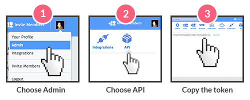

Getting Started
===============

Before working with PhpPulse, you **must** set the API key; make sure `your plan`__ has access to the API. Once your plan has access, then get the API key from your admin panel.

__ https://dapulse.com/pricing/

After you have copied your API key, use the ``setApiKey()`` static method available in all of the Pulse objects. Depending on the class being used on your code, that is the class you can use so you do not have to add another ``use`` statement.

.. code:: php

   use allejo\DaPulse\Pulse;

   Pulse::setApiKey("my api key here");

   $pulse = new Pulse(12345);

   // ...

If I don't need to ``use`` the Pulse class, then I can also set the key with PulseBoard.

.. code:: php

   use allejo\DaPulse\PulseBoard;

   PulseBoard::setApiKey("my api key here");

   $board = new PulseBoard(12345);

   // ...

Warnings
--------

- **Never** commit your API key to version control. Your key should always be stored in a configuration file that is read by the code; this configuration file should also **never** be committed to version control. An API key may be regenerated but the API gives full read/write access to all of your team's DaPulse content.

Troubleshooting
---------------

If you get an **HttpException** with an error code of 401, that may mean your API key wasn't set or is invalid.